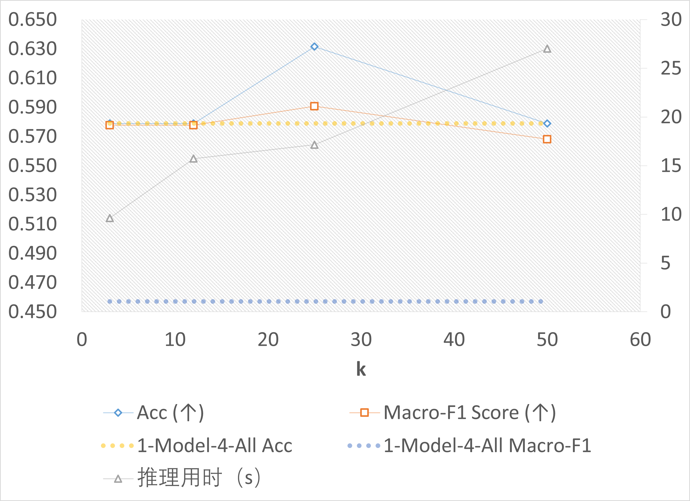

<p align="center">
    <h1 align="center">Discovering Test-Time Training on Traditional ML Models - Course Project of Data Mining in THU 2024 Fall</h1>
</p>
<p align="center">
    <em>Scale the correct model on the correct data distribution.</em>
</p>
<p align="center">
	<!-- local repository, no metadata badges. --></p>
<p align="center">
		<em>Built with the tools and technologies:</em>
</p>
<p align="center">
	
	
	
	
	
	
</p>

<br>

##### 🔗 Table of Contents

- [📍 Overview](#-overview)
- [📂 Repository Structure](#-repository-structure)
- [🧩 Modules](#-modules)
- [🚀 Getting Started](#-getting-started)
    - [🔖 Prerequisites](#-prerequisites)
    - [📦 Installation](#-installation)
    - [🤖 Usage](#-usage)
- [🙌 Acknowledgments](#-acknowledgments)

---

## 📍 Overview

The code repo is of the course project of Data Mining in the fall semester of 2024 in Tsinghua University. Based on the repo, here are two features that are implemented:
- **Test-Time Training on Xgboost Models**: The repository supports test-time training on Xgboost models in classification and regression tasks. The codebase provides evidence that test-time training can improve traditional ML models with scaled inference compute (see the figure below). An empirical insight: *This property might work well on high-dimensional or long-tailed data*.
- **LLM-based Many-shot ICL in Classification and Regression Tasks**: The repository supports LLM-based many-shot ICL in classification and regression tasks, with batched prompting. Instead of targeting on the best performance, the codebase uses it to interpret the decision-making process in these traditional ML tasks.



---

## 📂 Repository Structure

```sh
└── project-dir/
    ├── KNN_FS_LLM_code
    ├── XGBoost_code
    ├── preprocess
    ├── requirements.txt
    ├── report.md
    └── rrl-DM_HW
```

---

## 🧩 Modules

<details closed><summary>preprocess/</summary>

| File | Summary |
| --- | --- |
| [analyze_\*.py](dm-interpretabledm/preprocess/analyze_test_set.py) | Analyzes data by generating descriptive statistics. |
| [preprocess_data\*.py](dm-interpretabledm/preprocess/preprocess_data.py) | Facilitates data preprocessing for various datasets by loading, cleaning, and normalizing features. |
| [clean_data\*.py](dm-interpretabledm/preprocess/clean_data_wo_scaling.py) | Cleansing data for various datasets. |
| [visualization.py](dm-interpretabledm/preprocess/visualization.py) | Visualizes dataset features. |

</details>

<details closed><summary>XGBoost_code/</summary>

| File | Summary |
| --- | --- |
| [experiment_ttt.py](dm-interpretabledm/XGBoost_code/experiment_ttt.py) | The script of test-time training on Xgboost with $k$NN retrived training samples. |
| [experiment.py](dm-interpretabledm/XGBoost_code/experiment.py) | Experimenting bare Xgboost models. |
| [args.py](dm-interpretabledm/XGBoost_code/args.py) | Facilitates user-defined configurations for XGBoost model training. |


</details>

<details closed><summary>KNN_FS_LLM_code/</summary>

| File | Summary |
| --- | --- |
| [experiment.py](dm-interpretabledm/KNN_FS_LLM_code/experiment.py) | Running and evaluating many-shot in-context learning with gpt-4o-mini in classification and regression tasks.  |
| [experiment_knn.py](dm-interpretabledm/KNN_FS_LLM_code/experiment_knn.py) | Experimenting bare $k$NN models. |
| [args.py](dm-interpretabledm/KNN_FS_LLM_code/args.py) | Facilitates user-defined configurations for many-shot in-context learning with LLMs. |

</details>

---

## 🚀 Getting Started

### 🔖 Prerequisites

Download datasets from the following sources:
- [**Breast Cancer**](https://drive.google.com/file/d/1GzmJcjbHegjqtj2RY0bwMM40wsI2IXpG/view?usp=sharing)
- [**Bank Marketing**](https://archive.ics.uci.edu/dataset/222/bank+marketing)
- [**Boston Housing**](https://www.kaggle.com/datasets/altavish/boston-housing-dataset)

And unzip them in the root directory of the project as follows:

```sh
└── project-dir/
    ├── breast_cancer_elvira_data/
    ├── bank_marketing_data/
    ├── boston_housing_data/
    ...
```

### 📦 Installation

- Dependencies can be installed using the following command:

```sh
pip install -r requirements.txt
```

- Data preprocessing can be performed using the following command:

```sh
bash preprocess/preprocess.sh
```

### 🤖 Usage

- To try the test-time training on Xgboost models, execute the following command: 

```sh
bash XGBoost_code/run_exp.sh
```

- To try the LLM-based many-shot ICL in classification and regression tasks, execute the following command:

```sh
bash KNN_FS_LLM_code/run_exp.sh
```

---

## 🙌 Reference

1. S. Moro, R. Laureano and P. Cortez. Using Data Mining for Bank Direct Marketing: An Application of the CRISP-DM Methodology. In P. Novais et al. (Eds.), Proceedings of the European Simulation and Modelling Conference - ESM'2011, pp. 117-121, Guimarães, Portugal, October, 2011. EUROSIS.
2. Zhuo Wang, Wei Zhang, Ning Liu, and Jianyong Wang. 2024. Scalable rule-based representation learning for interpretable classification. In Proceedings of the 35th International Conference on Neural Information Processing Systems (NIPS '21). Curran Associates Inc., Red Hook, NY, USA, Article 2332, 30479–30491.
3. [Text Classification via Large Language Models](https://aclanthology.org/2023.findings-emnlp.603) (Sun et al., Findings 2023)
4. [Batch Prompting: Efficient Inference with Large Language Model APIs](https://aclanthology.org/2023.emnlp-industry.74) (Cheng et al., EMNLP 2023)
5. Yu Sun, Xiaolong Wang, Zhuang Liu, John Miller, Alexei A. Efros, and Moritz Hardt. 2020. Test-time training with self-supervision for generalization under distribution shifts. In Proceedings of the 37th International Conference on Machine Learning (ICML'20), Vol. 119. JMLR.org, Article 856, 9229–9248.
6. Lu, H., Sun, S., Xie, Y., Zhang, L., Yang, X., and Yan, J., “Rethinking Classifier Re-Training in Long-Tailed Recognition: A Simple Logits Retargeting Approach”, *arXiv e-prints*, arXiv:2403.00250, 2024.

---
