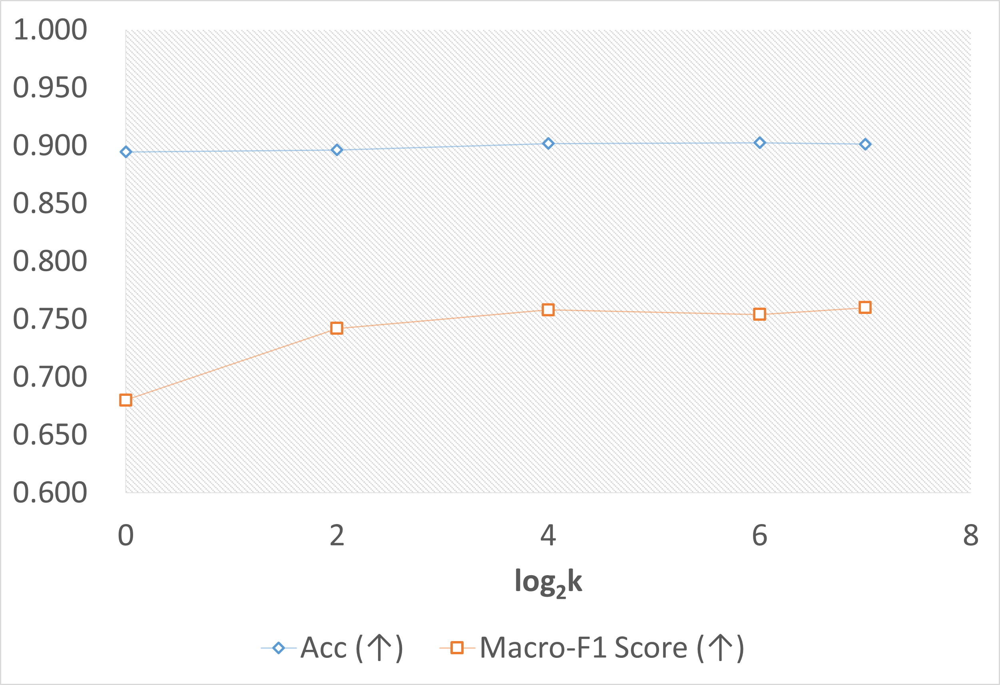
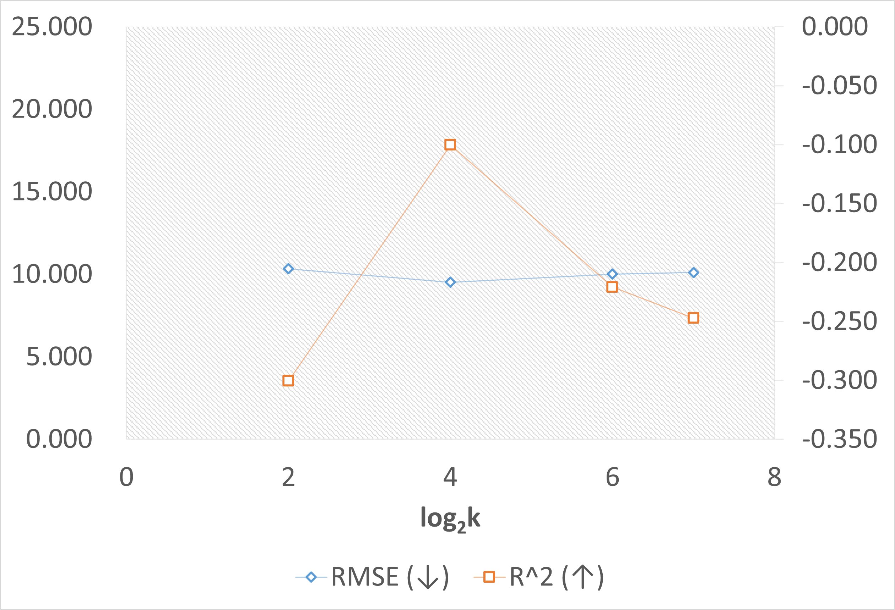
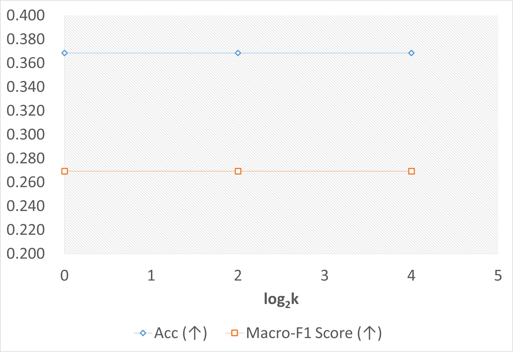
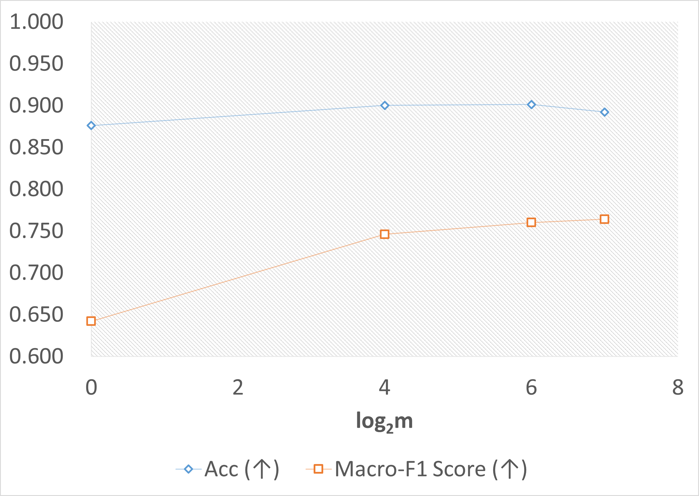
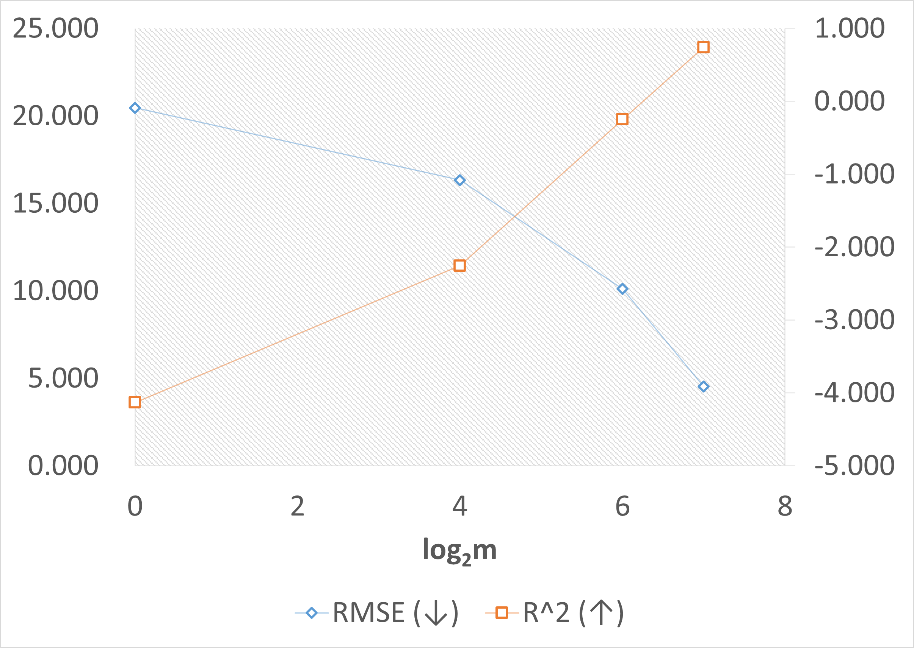
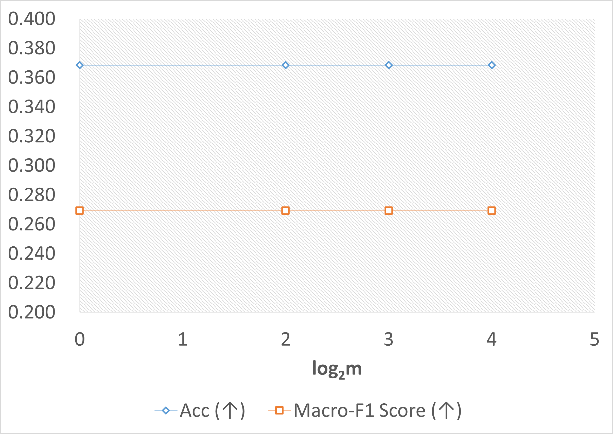
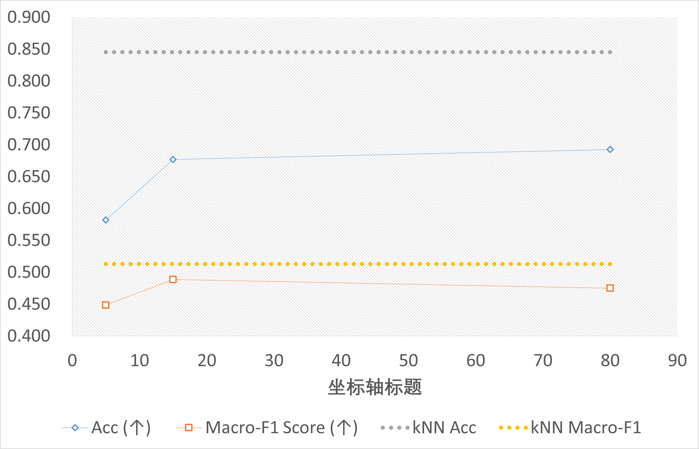
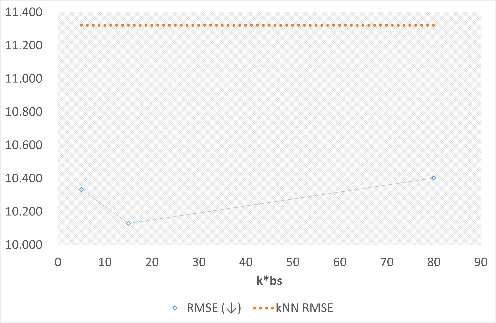
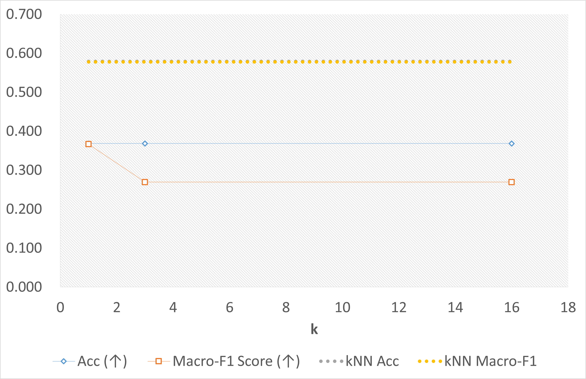

# 可解释数据挖掘实践实验报告

本实验基于 [**Bank Marketing**](https://archive.ics.uci.edu/dataset/222/bank+marketing)、[**Boston Housing**](https://www.kaggle.com/datasets/altavish/boston-housing-dataset)、[**Breast Cancer**](https://www.kaggle.com/datasets/theoneandonlyp/breast-cancer-elvira-biomedical-dataset/data?select=breastCancer_Total.dbc)\[1\] 数据集，对数据进行可解释挖掘——具体而言，进行可解释分类与回归。通过实验不同的可解释性算法（包括“*Scalable Rule-Based Representation Learning for Interpretable Classification*”论文\[2\]提出的RRL模型），评估其性能和适用性，并完成实证分析和改进。

## 1. 数据分析及预处理


主要代码位于`preprocess`目录下。

### 1.1 数据来源与结构

- **Bank Marketing**数据集包含45211名客户在葡萄牙银行的电话营销活动中的个人信息数据，后通过数据清洗形成了如下数据集结构，数据集旨在用于分类任务，目标是通过其他个人信息预测预测客户是否会订购定期存款：

    - **样本数量**：45211条记录；
    - **特征维度**：16维向量，包含7个数值型特征与9个类别型特征；
    - **标签类别**：共2种类型，分别为`yes`, `no`，表示客户是否订阅定期存款。

- **Boston Housing**数据集包含506个波士顿房产价格记录，后通过数据清洗形成了如下数据集结构，数据集旨在用于回归任务，目标是通过波士顿房产的其他信息预测房产价格：

    - **样本数量**：506条记录；
    - **特征维度**：13维向量，均为数值型特征；
    - **标签类别**：数值型特征，表示房产价格。

- **Breast Cancer**数据集包含97位乳腺癌患者的基因数据和复发情况，后通过数据清洗形成了如下数据集结构，数据集旨在用于分类任务，目标是通过患者的基因信息预测乳腺癌是否会复发：

    - **样本数量**：97条记录；
        - **训练集**：78条记录；
        - **测试集**：19条记录；
    - **特征维度**：24188维向量，均为数值型特征；
    - **标签类别**：共2种类型，分别为`relapse`, `non-relapse`，表示乳腺癌是否会复发。

### 1.2 数据集统计性分析

#### 1.2.1 缺失值检测

对数据集检测缺失值，如果存在缺失值，应该进行剔除或填补。核心代码段：

```python
# 缺失列数量
X_data.isnull().all().sum()
# 缺失值数量
data.isnull().sum().sum()
```

**结果**：
- Bank Marketing数据集无缺失值；
- Boston Housing数据集存在120个缺失值，无整列缺失；
- Breast Cancer数据集存在36458（训练集）+5568（测试集）=42026个缺失值，293个缺失列。

#### 1.2.2 重复值检测

对数据集检测重复值，如果存在重复值，应该进行剔除，避免计算冗余或影响算法结果。核心代码段：

```python
data.duplicated().sum()
```

**结果**：所有数据集均无重复值。

#### 1.2.3 异常值检测

对数据集检测异常值，通过数据集描述可得每个特征对应的取值范围，并依次检查每个特征值是否在范围外：

**结果**：数据集均无异常值。

#### 1.2.4 标签类别分析

对数据集统计各标签对应的样本数量，类别型标签绘制条形图，数值型标签绘制直方图，各数据集可视化结果如下所示：

- Bank Marketing数据集标签分布：
    
- Boston Housing数据集标签分布：
    
- Breast Cancer训练集标签分布：
    
- Breast Cancer测试集标签分布：
    

**结论**：各数据集中各类别样本数量分布均匀度不一：
- Bank Marketing数据集标签分布不均匀，标签为`no`的样本数量远大于`yes`；
- Boston Housing数据集标签分布较不均匀，大部分房价分布较为集中，但存在少量高价房；
- Breast Cancer数据集标签分布较均匀，但样本数量整体较少。

根据原论文\[2\]的处理方式，数据处理时不进行类别平衡处理。

#### 1.2.5 特征分布分析

对数据集统计均值与标准差，绘制特征分布折线图，如下所示：

- Bank Marketing数据集特征分布：
    
- Boston Housing数据集特征分布：
    
- Breast Cancer训练集特征分布：
    
- Breast Cancer测试集特征分布：
    

**结论**：各数据集平均值和标准差存在一定的波动，说明各数据集不同特征的分布存在一定的差异，后续需要进行数据归一化处理。由于未出现标准差极小的情况，因此不需要对特征进行剔除。

> 对于可能存在的噪声点，本实验于数据归一化后进行进一步分析，以判断是否以及如何进行数据清洗。

---

#### **总结可能影响后续实验分析的问题**

可能影响后续实验分析的主要问题包括：

1. **特征分布不均衡**：某些特征的均值和标准差波动较大，可能导致模型处理时某些特征对结果的影响更为显著，而其他特征则可能被忽略。较高的数据维度会进一步放大此问题。因此，有必要对特征进行归一化处理，以减小特征间的差异，包括类别型和数值型特征，确保各算法对所有特征的考虑更加平衡。

2. **潜在噪声**：尽管数据未检测到异常值，但部分特征的分布显示出较大的波动性，可能存在未处理的噪声点。这可能会影响模型的准确性和稳定性，因此在归一化后需进一步分析是否存在需要处理的噪声点。

3. **特征相关性**：部分特征的标准差与均值波动剧烈，暗示不同特征之间可能存在较强的相关性。一种处理方式是进行降维处理，例如主成分分析（PCA），以减少特征间的冗余信息，提高算法的效率和准确性。但根据原论文\[2\]的处理方式，在实验中保留了所有特征。

并且，由于Breast Cancer数据集维度较高、样本较少，可能存在部分分类算法适配困难、效果降低的问题，对于基于规则、基于深度学习等的方法挑战均较大，因此，在后续实验中，我们选择了多种算法对比分析，以便对比不同类型算法的性能和适用性。

### 1.3 数据预处理

主要进行了缺失值填充、特征归一化等操作，并剔除了噪声点。

#### 1.3.1 缺失值填充

对各数据集的缺失值进行填充。对于数值型特征，填充方法为使用特征列的均值填充；对于类别型特征，填充方法为使用特征列的众数填充。对于全列缺失的特征，直接剔除。值得注意的是，测试集需要用训练集特征值填充。核心代码段：

```python
numeric_columns = X_train_original.select_dtypes(include=['float64', 'int64']).columns
categorical_columns = X_train_original.select_dtypes(include=['object']).columns

if len(numeric_columns) > 0:
    X_train_original[numeric_columns] = imputer_numeric.fit_transform(X_train_original[numeric_columns])
if len(categorical_columns) > 0:
    X_train_original[categorical_columns] = imputer_categorical.fit_transform(X_train_original[categorical_columns])
```

#### 1.3.2 数据归一化

采用标准化方法，将每个特征缩放到相同的尺度。**值得注意的是，缩放尺度是使用训练集计算得到的，并直接应用于测试集的缩放，从而防止了数据泄露。**核心代码段：

```python
scaler = StandardScaler()
scaler.fit(X_train)
X_train_scaled = scaler.transform(X_train)
X_test_scaled = scaler.transform(X_test)
```

归一化前后的数据特征分布对比：

- Bank Marketing数据集特征分布对比：
    
    
- Boston Housing数据集特征分布：
    
    
- Breast Cancer训练集特征分布：
    
    
- Breast Cancer测试集特征分布：
    
    

**结论**：
- 归一化后，训练集的平均值归0，标准差归1，特征分布更加均匀，可能有利于算法的收敛。
- 归一化前，测试集的特征分布与训练集保持一致，均存在一定的波动，但归一化后的测试集的平均值和标准差接近0和1，说明归一化操作也能有效降低同领域同分布的其他数据的特征差异。

#### 1.3.3 归一化后数据可视化及噪声点去除

实验对归一化后的数据进行了降维处理，使用PCA方法将数据降至2维，并绘制了散点图，点的颜色表示数据集给定的类型标签，如下所示：

- Bank Marketing数据集可视化：
    
- Boston Housing数据集可视化：
    
- Breast Cancer训练集可视化：
    
- Breast Cancer测试集可视化：
    

在各训练集的可视化图中能发现明显的离群点或异常点，因此在实验中对这些点进行了剔除处理，以保证后续实验分析的准确性。使用`z-score`方法计算归一化后数据点的离群程度，剔除离群程度较高的数据点。特别地，类别型特征也被转换为 $[-1, 1]$ 区间内的连续值，参与`z-score`的计算。核心代码段：

```python
def remove_outliers_zscore(X, y, threshold=3.0):
    z_scores = stats.zscore(X)
    filter_condition = (abs(z_scores) < threshold).all(axis=1)
    return X[filter_condition], y[filter_condition], (~filter_condition).sum()
```

当一条样本存在某个特征的`z-score`大于阈值时，则剔除该数据。对于不同数据集，取的阈值如下：

|  Bank Marketing |  Boston Housing  |  Breast Cancer |
|:---------------:|:----------------:|:--------------:|
|       25.0      |        8.0       |       8.6      |

剔除后的数据集可视化结果如下：

- Bank Marketing数据集可视化：
    
- Boston Housing数据集可视化：
    
- Breast Cancer训练集可视化：
    

**结论**：从可视化图观察，方法有效剔除了大部分离群点，训练集的数据点分布更加集中，有利于后续算法对比分析的准确性和算法性能。

## 2. 可解释性算法实验

### 2.1 算法选择

实验选择以下三种不同类型的可解释算法进行实验：

- **规则表征学习器（RRL）**\[2\]，一种基于规则的可解释分类算法，并可适配到回归任务；
- **Xgboost**，一种基于梯度提升树的集成算法，通过每棵决策树的特征分支来解释模型；
- **Few-shot ICL on LLMs**，一种基于大型语言模型的少样本学习算法，通过上下文学习实现分类或回归任务，参照相关工作\[3\]少样本基于*k*NN算法检索。

其中第三种算法Few-shot ICL是手动实现的，主要代码文件位于`KNN_FS_LLM_code/experiment.py`。

### 2.2 算法相关原理简述

- **RRL**：RRL算法是一种基于规则的可解释分类算法，通过学习规则来解释模型的决策过程。对于给定样本`x`，模型 $\theta$ 分别对每个类别预测概率：
    $$ \bm{p} = \pi_\theta (x), \quad \bm{p} \in \mathbb{R}^{*K} $$
    其中，目标类别数量为`K`，$\bm{p} = \{p_i\}_{i=1}^K$ 为每个类别的预测概率。   
    实际将RRL适配到回归任务时，将其转化为分类任务，令 $K=1, \bm{p} \in \mathbb{R}$，将 $\bm{p}$ 作为回归结果；损失函数更改为`HuberLoss`。
    ```python
    # 模型输出处理部分；self.y_discrete == True表示分类任务，否则为回归任务
    y_bar = self.net.forward(X) / torch.exp(self.net.t)
    if self.y_discrete:
        y_arg = torch.argmax(y, dim=1)
    else:
        y_arg = y
    ```

- **Xgboost**：使用`Xgboost`库实现分类器与回归器，根据从训练集中划分的5\%验证集进行早停。

- **Few-shot ICL**：通过构建提示词，将*k*NN检索到的样本构造成多个`（特征，标签）`对，输入到大型语言模型作为上下文，进而将待预测样本的特征输入到模型中，得到预测结果。不同于RRL和Xgboost，二者将类别型特征转化为独热数值型特征，Few-shot ICL直接使用原始类别型特征。对于分类任务，在提示词中包含所有预测的类别目标；对于回归任务，提示大模型直接输出所预测的数值。*k*NN的距离度量中，类别型特征通过[GloVe词向量](https://nlp.stanford.edu/projects/glove/)进行编码，所使用的模型为`GloVe.6B.50d`。值得注意的是，Few-shot ICL的实现中，模型被要求直接输出用于处理待预测样本的规则，作为可解释性表征。
    ```python
    # 提示词模板设计
    CLS_TEMPLATE = """Please classify the given samples into one of the categories of {0}: {1}. Please conduct the classification based on the following examples:

    {2}

    Here are the samples to be classified:

    {3}

    Answer the category for each sample by using the double square brackets, e.g., [[category 1, category 2, ...]]."""
    REG_TEMPLATE = """Please estimate the {0} of given samples in float numbers. Please conduct the estimation based on the following examples:

    {1}

    Here are the samples to be estimated:

    {2}

    Answer the estimate result for each sample by using the double square brackets, e.g., [[value 1, value 2, ...]]."""
    if llm_args.task in ['classification', 'classification-test']:
        TEMPLATE = CLS_TEMPLATE
        INTERPRETABLE_TEMPLATE = TEMPLATE + " Then, provide the rules you used to classify the samples by using the double parentheses, e.g., ((Rule 1)); ((Rule 2)); ((Rule 3)); ..."
    elif llm_args.task == 'regression':
        TEMPLATE = REG_TEMPLATE
        INTERPRETABLE_TEMPLATE = TEMPLATE + " Then, provide the rules you used to estimate the samples by using the double parentheses, e.g., ((Rule 1)); ((Rule 2)); ((Rule 3)); ..."
    else:
        raise ValueError("Invalid task type: {}".format(llm_args.task))
    ```

### 2.3 算法差异分析

1. 复杂度分析

    | 算法名称             | 时间复杂度                  | 空间复杂度                   |
    |:--------------------:|:--------------------------:|:----------------------------:|
    | **RRL**  | $O(n \cdot K \cdot d)$      | $O(K \cdot d)$            |
    | **Xgboost**          | $O(n \cdot d \cdot T)$      | $O(T)$            |
    | **Few-shot ICL**     | $O(k \cdot n \cdot d + k^2 \cdot d^2)$      | $O(n \cdot d + k \cdot d)$    |

    其中：$n$ 是样本数；$d$ 是特征维度；$K$ 是类别数；$T$ 是树的数量（对于Xgboost）；$k$ 是近邻数目（在Few-shot ICL中应用于*k*NN）。

    - **RRL**
        - **时间复杂度**：RRL的时间复杂度为 $O(n \cdot K \cdot d)$。算法通过训练规则来计算每个类别的预测概率，需要遍历所有样本、类别和特征。
        - **空间复杂度**：RRL的空间复杂度为 $O(K \cdot d)$。空间主要用于存储规则模型，而模型参数量与类别数和特征维度相关。

    - **Xgboost**
        - **时间复杂度**：Xgboost的时间复杂度为 $O(n \cdot d \cdot T)$，每一棵树的构建过程需要遍历每个样本和特征。
        - **空间复杂度**：空间复杂度为 $O(T)$，随着树数量的增加，存储每棵树的结构需要较大的空间。

    - **Few-shot ICL**
        - **时间复杂度**：Few-shot ICL的时间复杂度为 $O(k \cdot n \cdot d + k^2 \cdot d^2)$。对于每个样本，算法通过查询最相似的 $k$ 个近邻，计算这些近邻的特征与待预测样本的距离，所需的时间为 $O(k \cdot n \cdot d)$；进而使用大模型推理，而推理的复杂度是平方级别的。
        - **空间复杂度**：空间复杂度为 $O(n \cdot d + k \cdot d)$，主要用于存储数据集的特征和近邻查询的结果。对于每个样本，空间复杂度需要存储其所有的特征，并且使用 $k$ 个近邻样本构建提示词。

2. 可解释性比较

    总体而言，不同算法得到的规则表征的可解释性排序如下：

    **Few-shot ICL** > **RRL** > **Xgboost**

    - **RRL**：RRL算法通过学习规则来解释模型的决策过程，可以直接从规则中提取特征的重要性和决策过程，提供了较高的可解释性。但其规则的数量和复杂度可能会影响解释的清晰度。
    - **Xgboost**：Xgboost算法通过特征重要性分析来解释模型的决策过程，可以提供一定的可解释性。但其基于集成的模型结构较为复杂，无法直接展示规则，需要利用SHAP等方法再分析，因此可解释性相对较差。
    - **Few-shot ICL**：Few-shot ICL算法通过大型语言模型进行推理，可以提供较高的可解释性。通过提示词的设计和大模型的输出，可以直接通过自然语言展示模型的推理过程与相应规则，提供了较高的可解释性，然而性能和规则准确度无法保证。

3. 适用场景比较

    - **RRL** 适用于需要高度可解释的分类任务，尤其是规则学习能够很好地表征决策过程。由于其能够直接从训练中拟合规则并用于预测，因此在面对高维数据时，规则学习可能会出现过拟合，尤其是在数据维度较高时。
        - 适合于数据集相对较小且较为平衡的场景。
    
    - **Xgboost** 是一种常见的梯度提升决策树方法，适用于各类分类和回归问题，尤其在数据量较大且特征较多的情况下表现优越。它的优点在于能够自动处理特征的非线性关系，并且通过特征重要性分析可以提供一定的可解释性。然而，它的模型结构复杂，且其内在机制并不像RRL那样直接展示规则。
        - 适用于大规模高维数据集，但模型的可解释性相对较差。
    
    - **Few-shot ICL** 是一种基于大型语言模型的少样本学习方法，特别适合于类别样本较少且希望利用语言模型进行推理的任务。尽管其处理类别型数据较为灵活，但其准确性受限于预训练模型的能力。该方法在面对复杂语境或多任务学习时较为有效，但其对计算资源要求较高且对模型的提示设计和调优要求较高。
        - 适用于需要快速适应新类别或任务的场景，尤其是在数据稀缺或需要自然语言逻辑推理的情况下。
    
4. 实现难度比较

    - **RRL** 实现难度较高，规则学习器的逻辑较为复杂，其实现复杂度主要体现在如何设计训练和推理时的规则表征。
    
    - **Xgboost** 实现较为复杂，其模型结构与算法细节较多，导致了较高的实现难度。对于大规模数据集而言，分布式训练也增加了实现复杂度。
    
    - **Few-shot ICL** 实现难度较低，只需要手动设计提示词和调试大型语言模型的输出。

### 2.4 实验设置

#### 2.4.1 算法实现

以下为实验中使用的算法实现设置：

- **RRL**：使用论文\[2\]中提供的代码实现，在默认设置外，在Bank Marketing数据集使用网格搜索调整超参数，搜索范围分别是：`learning_rate` $\in [2\times 10^{-4}, 1\times 10^{-3}, 5\times 10^{-3}]$，`temperature` $\in [0.01, 0.1, 1]$，`weight_decay` $\in [0, 1\times 10^{-5}, 1\times 10^{-4}, 1\times 10^{-2}]$。各数据集应用的最优超参数为：`learning_rate` $= 1\times 10^{-3}$，`temperature` $= 1$，`weight_decay` $= 0$。并且，在Bank Marketing数据集搜索不同模型架构后，发现单逻辑层或双逻辑层的模型效果较好，因此在主要实验中使用的模型逻辑层架构为`128@1024`。由于Breast Cancer数据集维度较高，受显存限制，主要实验中使用的模型逻辑层架构为`16@32`。
- **Xgboost**：使用`Xgboost`库实现，对于分类任务，使用`Xgboost`的`XGBClassifier`，对于回归任务，使用`Xgboost`的`XGBRegressor`。早停策略的判断阈值为50步。在Bank Marketing数据集使用网格搜索调整超参数，搜索范围分别是：`learning_rate` $\in [1\times 10^{-2}, 1\times 10^{-1}, 1]$，`max_depth` $\in [3, 5, 7]$，`gamma` $\in [0, 0.1, 0.3]$。主要实验中各数据集应用的最优超参数为：`learning_rate` $= 0.1$，`max_depth` $= 7$，`gamma` $= 0.3$；使用的线程数为16。
- **Few-shot ICL**：使用`GloVe.6B.50d`预训练词向量，使用`gpt-4o-mini-2024-07-18`模型进行推理，`temperature`设置为0。最大输入大模型的维度为64，超过64维特征的样本的后续特征会被截断。实验中主要使用的近邻数 $k=3$，并且为节省开销，将5次推理通过Batch Prompting\[4\]合并；因此实验中主要使用的样本数为15。对于Bank Marketing数据集，由于数据集规模过大，仅使用了随机采样1%的子集。对于Breast Cancer数据集，由于特征维度较高，受上下文窗口长度限制，未使用Batch Prompting，因此主要实验中使用的样本数为3。各实验中使用的大模型请求线程数为16。

> 后续实现的推理时训练方法的实验设置相同。

#### 2.4.2 评价指标

实验中采用了多样的评价指标：

**性能指标**：
- 分类任务：准确率（Accuracy，Acc）、宏平均F1分数（Macro-F1 Score）；越大越好；
- 回归任务：均方根误差（Root Mean Squared Error，RMSE），越小越好；R平方（R-Squared，$R^2$），越大越好。

**复杂度指标**：
- 训练用时：模型训练的平均总时间；用秒（s）表示，越小越好。
- 推理用时：模型推理整个测试集的平均时间；用秒（s）表示，越小越好。

特别地，由于Bank Marketing数据集与Breast Cancer数据集并未提供测试集，因此在实验中对这两个数据集进行5折交叉验证，以评估模型的性能。

### 2.5 实验结果

#### 2.5.1 主要实验

- Bank Marketing数据集实验结果：

    > \*代表使用了1%的子集

    | 方法 | Acc (↑) | Macro-F1 Score (↑) | 训练用时（s） (↓) | 推理用时（s） (↓) |
    |:--------:|:-------------:|:------------:|:-------------:|:-------------:|
    | **RRL**  |     0.892     |     **0.764**     |   10354.446       |     3.037       |
    | **Xgboost** | **0.909**         | 0.749        | 0.812         | **0.027**         |
    | **Few-shot ICL**\* | 0.677         | 0.489        | **0.006**         | 7.994           |

- Boston Housing数据集实验结果：

    | 方法 | RMSE (↓) | 训练用时（s） (↓) | 推理用时（s） (↓) |
    |:--------:|:-------------:|:-------------:|:-------------:|
    | **RRL**  |    4.528      |   142.849         | 0.900         |
    | **Xgboost** | **4.049**        | 5.624         | **0.020**         |
    | **Few-shot ICL** | 10.129         | **0.001**         | 9.716         |

- Breast Cancer数据集实验结果：

    | 方法 | Acc (↑) | Macro-F1 Score (↑) | 训练用时（s） (↓) | 推理用时（s） (↓) |
    |:--------:|:-------------:|:------------:|:-------------:|:-------------:|
    | **RRL**  | 0.368         | 0.269        | 188.952         | 0.987         |
    | **Xgboost** | **0.579**         | **0.457**        | 39.692         | **0.011**         |
    | **Few-shot ICL** | 0.368         | 0.269        | **0.009**         | 19.410         |

---

**实验结果分析**

从实验结果可以看出：
- **模型性能**：
    - **RRL**在低维、规模较大的分类、回归数据集上的性能表现较好，但在高维数据集上的性能较差。RRL和Few-shot ICL在Breast Cancer数据集上的表现相同，其他数据集上均有超过Few-shot ICL，这可能与数据的高维性和样本数量较少有关；RRL规则学习器和Few-shot ICL的大模型推理均未能适配这一特殊场景，导致所有的预测结果均为不复发（`non-relapse`）。
    - **Xgboost**在各项任务中均表现最好，尽管RRL在Bank Marketing数据集的宏平均F1分数上略胜一筹，但整体差异不显著。Xgboost在回归任务中的表现最佳，也能适配高维场景。
    - **Few-shot ICL**在各数据集上的性能均较差，这可能是算法对上下文示例的利用能力较差有关，尤其是Bank Marketing实验中仅使用了1\%的子集。其在回归任务上的表现不佳，可能说明其对数值型目标变量的回归任务适配性较差。
- **训练与推理时间**：
    - **RRL**的训练时间较长，推理时间与训练时间正相关，处于中间水平。
    - **Xgboost**的训练时间远低于RRL，推理时间也最短，展现了较高的效率。
    - **Few-shot ICL**的训练时间极短，这与其无需显式训练模型有关。但其推理时间较长，主要因为每次推理需要调用大型语言模型，这种计算开销在高维数据集上变得显著。

---

**总体实验结论**
1. **算法选择**：
    - **RRL**在需要较高解释性的场景中仍具有优势，但在高维、样本稀少的数据集上表现欠佳。
    - **Xgboost**是综合性能、效率、适配性最优的算法，适用于大多数分类与回归任务。
    - **Few-shot ICL**适用于数据量较小、类别型特征占比高的场景，但其性能欠佳，且推理时间过长，在需要效率的场景中表现不理想，但在无需显式训练的条件下提供了一种轻量级选择。

2. **数据集特性对算法的影响**：
    - 对于特征维度较低、样本量大的分类数据集（如Bank Marketing），Xgboost表现最佳，RRL具备一定竞争力。
    - 对于特征维度较低、样本量适中的回归数据集（如Boston Housing），Xgboost依然保持最优，RRL是较好的次优选择。
    - 对于特征维度高、样本量小的数据集（如Breast Cancer），Xgboost的鲁棒性和性能占优，而RRL和Few-shot ICL难以适配。

#### 2.5.2 RRL规则表征分析实验

在此分析实验中，首先分别调整了RRL模型中 $k$ 的取值，从而调整数值型特征阈值的个数，以观察模型性能的变化。实验结果如下（实验中RRL模型逻辑层架构为 $k$`@64`，特别的，Breast Cancer数据集的模型逻辑层架构为 $k$`@32`）：

- Bank Marketing数据集实验结果：

- Boston Housing数据集实验结果：

- Breast Cancer数据集实验结果：


进而分别调整了RRL模型可生成的规则的最大数量——即最后一个逻辑层的神经元数量（图表中记为 $m$），以观察模型性能的变化。实验结果如下（实验中RRL模型逻辑层架构为`128@`$m$，特别的，Breast Cancer数据集的模型逻辑层架构为`16@`$m$）：

- Bank Marketing数据集实验结果：

- Boston Housing数据集实验结果：

- Breast Cancer数据集实验结果：


**实验结论**：
- RRL模型对于 $k$ 的取值不敏感。在Bank Marketing数据集上，模型性能随着 $k$ 的增大而略有提升，这可能是因为数据集规模较大，模型需要提取更多的细粒度特征来解释数据的决策过程；而在其他两个数据集上，模型性能基本保持不变。
- RRL模型对于可生成的规则的最大数量较为敏感。在Bank Marketing数据集和Boston Housing数据集上，模型性能随着 $m$ 的增大均有稳定的提升，说明模型需要更多的规则来完成数据的决策过程，并且模型在低维大规模数据中能够有效提取更多的规则帮助任务；而在Breast Cancer数据集上，模型性能始终未发生变化，可能是特征维度过高导致模型无法在当前的参数规模下提取合理的规则。

#### 2.5.3 从Few-shot ICL到Many-shot ICL分析实验

在此分析实验中，调整了Few-shot ICL方法中近邻数 $k$ 的取值，从而调整大模型上下文学习的示例数量，以观察模型性能的变化。由于在Bank Marketing数据集和Boston Housing数据集使用了Batch Prompting，因此此时上下文示例数量为 $k \times bs$，其中 $bs$ 为推理的批大小；而Breast Cancer数据集的上下文示例数量为 $k$。实验结果如下：

- Bank Marketing数据集实验结果：

- Boston Housing数据集实验结果：

- Breast Cancer数据集实验结果：


**实验结论**：
- 大语言模型可以通过增加上下文示例数量来提升低维数据分类任务性能，在Bank Marketing数据集中，从few-shot转变为many-shot方法可以显著提升效果，这可能是因为数据集维度较低，模型能够从更多的上下文示例获取信息来进行推理。
- 但对于回归任务，以及高维数据集，增加上下文示例数量并不能显著提升模型性能，这可能是因为数据集的复杂性和维度较高，模型无法从更多的上下文示例中获取有效信息。
- 在分类任务中，Few-shot ICL的性能始终低于直接通过 $k$NN进行投票的方法，但在回归任务中，Few-shot ICL的性能高于直接通过 $k$NN进行平均的方法，这可能是因为当前分类任务的目标类别少，$k$NN投票时的噪声影响不大；而回归任务的目标值是连续的，需要大模型推理给出更合理的预测结果。

#### 2.5.4 基于Xgboost的推理时训练实验

在此分析实验中，目标在于进一步增强Xgboost方法在Breast Cancer数据集上的性能。从以上实验结果可以看出，对于高维、小规模数据集，Xgboost的性能表现较好，但在Breast Cancer数据集上的性能仍有提升空间。因此，本实验中结合 $k$NN方法与Xgboost，实现了推理时训练方法，以进一步提升Xgboost在Breast Cancer数据集上的性能。具体方式为：在推理时，对于每个待预测样本，使用$k$NN方法检索到其近邻样本，将这些样本的特征与标签作为训练集，使用Xgboost进行训练，得到一个新的模型，再对待预测样本进行预测——即对每个待预测样本训练一个模型。实验结果如下：

- Breast Cancer数据集实验结果（`1-Model-4-All`表示在全训练集训练了单个模型，同主要实验）：


**实验结论**：

推理时训练方法能够显著提升Xgboost在Breast Cancer数据集上的性能：随着近邻数 $k$ 的增大，性能提升更为明显；但 $k$ 过大时，性能会有所下降，这可能是因为训练集的样本过多，导致模型拟合分布产生变化，偏离当前待预测样本。同时，推理时训练方法会导致推理用时大幅度增加。

## 3. 分析与讨论

### 3.1 可解释性规则表征分析

RRL与Few-shot ICL形成的可解释性规则表征样例如下（Xgboost无法直接展示规则），直接选取RRL和Few-shot ICL在每个数据集上形成的一条代表性规则进行定性分析：

|    数据集    |     RRL   |    Few-shot ICL    |
|:------------:|:---------:|:------------------:|
| Bank Marketing | \[contact_unknown & age <= 1.858 & balance <= 1.187 & day <= -1.109 & duration <= -0.464 & pdays <= -0.035\] | Single individuals with "loan: yes" generally lead to a "no" classification if other financial indicators are weak, e.g., low balance or higher age. |
| Boston Housing |    (0.1889) \[NOX > -1.409 & RM > 0.126 & B > -0.779 & CRIM <= 0.357 & INDUS <= -0.903 & RAD <= -0.466 & PTRATIO <= 0.625 & LSTAT <= 0.291\]      |     INDUS and RAD have variable impacts on MEDV; high INDUS generally leads to lower MEDV, while higher RAD correlates with lower estimations as well.   |
| Breast Cancer | [Contig64596_RC <= -0.742] | Values less than zero are generally classified as "relapse" unless there are strong positive indicators in the same sample which suggest "non-relapse". |

---

#### 1. **规则的表达形式**
- **RRL**：
    - 规则表征以逻辑表达式的形式给出，规则中每个条件（如`contact_unknown`、`age <= 1.858`）代表一个具体的特征约束，通过逻辑与（&）连接，表明满足这些条件的样本被归为某一类别或得到某一预测值。
    - 逻辑表达式适合精确表达复杂规则，尤其在数据特征明确、关系简单时表现较为直观。

- **Few-shot ICL**：
    - Few-shot ICL的规则以自然语言形式呈现，直接解释了特征的影响和可能的决策逻辑（如“低余额或较高年龄通常会导致分类为`no`”）。
    - 自然语言表述更适合非技术用户理解，同时可以结合上下文提供更灵活的规则描述。

**对比总结**：
- RRL的规则形式精确且结构化，适合技术分析和后续逻辑验证，但对于复杂规则或大规模特征数据，其规则的复杂性可能会增加。
- Few-shot ICL的规则形式通俗易懂，适合用户直接解读，但规则的具体性和可操作性可能不如RRL。

#### 2. **规则的清晰性与复杂度**
- **RRL**：
    - RRL生成的规则清晰明确，但规则中可能包含较多的条件，尤其在高维数据集（如**Breast Cancer**数据集）中，可能需要处理大量特征。
    - 例如，在**Boston Housing**数据集中，RRL规则包含8个特征的约束，逻辑复杂度较高，对普通用户的可理解性较低。

- **Few-shot ICL**：
    - Few-shot ICL生成的规则较为简洁，通过自然语言归纳特征的影响而避免列出具体条件，降低了规则的复杂度。
    - 例如，在**Breast Cancer**数据集中，Few-shot ICL直接总结为“值小于0通常被归类为`relapse`”，规则非常直观，适合快速理解。

**对比总结**：
- RRL适合对复杂规则进行详细描述，但规则过多可能影响清晰性和实用性。
- Few-shot ICL则以牺牲规则的精确性为代价提升了简洁性和可理解性，适合生成高层次、概括性较强的规则。

#### 3. **规则的通用性与适用性**
- **RRL**：
    - RRL生成的规则具有较高的精确性和适用性，直接通过逻辑条件匹配样本特征，可用于自动化决策和后续分析。
    - 然而，由于规则依赖具体的特征取值和边界条件，通用性较低，特征取值发生变化时需要重新训练模型生成规则。

- **Few-shot ICL**：
    - Few-shot ICL的规则更具通用性，其自然语言形式便于将规则应用到类似场景中。
    - 例如，在**Boston Housing**数据集中，规则直接说明了特征`INDUS`和`RAD`对目标变量的影响方向，这种归纳性的描述可以适配到其他房价预测任务。
    - 然而，由于规则未列出具体的阈值或条件，其适用性较依赖模型生成的准确性，难以进行精确控制。

**对比总结**：
- RRL规则适用于自动化决策和细粒度分析，但通用性较低。
- Few-shot ICL规则适合总结特征影响的宏观规律，具备较好的通用性，但具体应用时需要额外判断。

**总体结论**：
1. **RRL**生成的规则以逻辑表达式形式呈现，清晰且适合自动化处理，尤其在特征数量适中且需要精确规则的场景中表现优越。但在高维数据集中，规则的复杂性可能增加，影响其可读性和解释性。
2. **Few-shot ICL**生成的规则以自然语言形式呈现，具备更高的直观性和通用性，尤其适用于非技术用户和需要总结规律的任务。然而，其规则可能缺乏精确性和操作性，适用场景受到一定限制。
3. **适用场景**：
   - **RRL**更适合需要细粒度规则和自动化决策的场景，如营销决策和信用风险评估。
   - **Few-shot ICL**更适合需要快速总结规律、生成直观解释的场景，如科研探索和教学应用。
4. **结合应用**：建议在实际应用中结合两种规则表征方式，通过RRL生成精确规则，通过Few-shot ICL提供辅助性、概括性的解释，以实现更全面的可解释性分析。

### 3.2 关于推理时开销扩展的讨论

当前的推理时训练方法与长尾数据的推理时重训练方法\[6\]存在相关性，以下进行分点讨论：

- **当前的推理时方法对于高维、低资源数据有效，存在应用于高资源长尾数据的能力。**对于高资源长尾数据，现有工作往往使用重训练方法\[6\]，以提升模型性能。实际上，推理时训练方法也可以与重训练方法结合，对于待预测的长尾数据，不仅可以重新微调模型参数，还可以进一步从零重新微调模型，以期取得更好的效果。

- **相比于针对于长尾数据的推理时重训练方法，一般的推理时训练方法\[5\]具有更广泛的适用性。**例如，当前基于 $k$NN 的推理时训练方法可以应用于分类、回归、甚至开放式任务中。

## 4. 结论

本实验通过对三种可解释性算法（RRL、Xgboost、Few-shot ICL）在分类与回归任务中的性能对比，发现Xgboost在综合性能和效率方面表现最佳，适用于大多数场景；RRL在规则精确性和解释性上具有显著优势，但对高维数据适配性较差；Few-shot ICL则以自然语言形式生成直观规则，适合快速理解和总结规律，但性能和效率有限。此外，推理时训练方法在高维低资源数据集上的性能提升显著，表明其在高维数据和长尾分布中的潜力。未来可通过结合多种方法，进一步优化可解释性和模型适配性。

## 小组成员

**组长**：刘子君

## 参考文献

1. S. Moro, R. Laureano and P. Cortez. Using Data Mining for Bank Direct Marketing: An Application of the CRISP-DM Methodology. In P. Novais et al. (Eds.), Proceedings of the European Simulation and Modelling Conference - ESM'2011, pp. 117-121, Guimarães, Portugal, October, 2011. EUROSIS.
2. Zhuo Wang, Wei Zhang, Ning Liu, and Jianyong Wang. 2024. Scalable rule-based representation learning for interpretable classification. In Proceedings of the 35th International Conference on Neural Information Processing Systems (NIPS '21). Curran Associates Inc., Red Hook, NY, USA, Article 2332, 30479–30491.
3. [Text Classification via Large Language Models](https://aclanthology.org/2023.findings-emnlp.603) (Sun et al., Findings 2023)
4. [Batch Prompting: Efficient Inference with Large Language Model APIs](https://aclanthology.org/2023.emnlp-industry.74) (Cheng et al., EMNLP 2023)
5. Yu Sun, Xiaolong Wang, Zhuang Liu, John Miller, Alexei A. Efros, and Moritz Hardt. 2020. Test-time training with self-supervision for generalization under distribution shifts. In Proceedings of the 37th International Conference on Machine Learning (ICML'20), Vol. 119. JMLR.org, Article 856, 9229–9248.
6. Lu, H., Sun, S., Xie, Y., Zhang, L., Yang, X., and Yan, J., “Rethinking Classifier Re-Training in Long-Tailed Recognition: A Simple Logits Retargeting Approach”, *arXiv e-prints*, arXiv:2403.00250, 2024.

## 附录

### 附录A：高资源低维特征任务下推理时训练方法分析

由于Xgboost在Bank Marketing数据集以及Boston Housing数据集上的性能表现较好，因此在这两个数据集上进行了推理时训练方法的实验，并没有取得效果的显著提升。实验结果如下：

- Bank Marketing数据集实验结果：

    > \*\*代表使用了10%的子集

    | 方法 | Acc (↑) | Macro-F1 Score (↑) | 训练用时（s） (↓) | 推理用时（s） (↓) |
    |:--------:|:-------------:|:------------:|:-------------:|:-------------:|
    | **Xgboost-1-Model-4-All** | **0.909**         | **0.749**        | 0.812         | **0.027**         |
    | **Xgboost** (k=128)\*\* | 0.831         | 0.506        | **0.076**         | 700.976        |

- Boston Housing数据集实验结果：

    | 方法 | RMSE (↓) | 训练用时（s） (↓) | 推理用时（s） (↓) |
    |:--------:|:-------------:|:-------------:|:-------------:|
    | **Xgboost-1-Model-4-All** | **4.049**        | 5.624         | **0.020**         |
    | **Xgboost** (k=128)\*\* |    11.902     |      **0.001**    |    22.661      |
    | **Xgboost** (k=384)\*\* |    11.926     |    0.012     |     32.276    |
